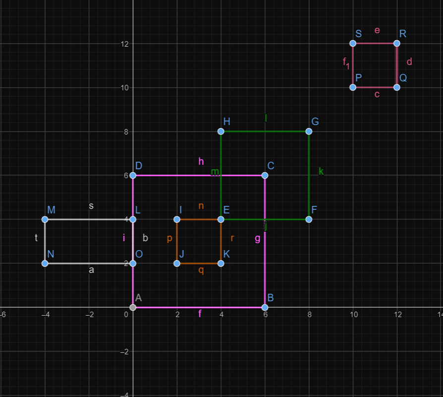

# Rectangle Analyzer 📐

This project provides TypeScript classes for working with geometric shapes, specifically points, segments, vectors, rectangles, and various use cases related to rectangles. The project includes functionality to calculate distances, check equality, intersections, adjacency, containment, and more.

The scope of this project is 2D.



## Item List 📋

- [Rectangle Analyzer 📐](#rectangle-analyzer-)
  - [Item List 📋](#item-list-)
  - [Usage 🚀](#usage-)
    - [Installation](#installation)
    - [Scripts](#scripts)
      - [Start](#start)
      - [Build](#build)
      - [Test](#test)
  - [Mathematical Explanation 🧮](#mathematical-explanation-)
    - [Calculate Intersections of two Rectangles](#calculate-intersections-of-two-rectangles)
    - [Determine if two rectangles are Adjacent](#determine-if-two-rectangles-are-adjacent)
    - [Determine if a rectangle is contained by other](#determine-if-a-rectangle-is-contained-by-other)
  - [Entities 🧩](#entities-)
    - [Point](#point)
    - [Segment](#segment)
    - [Vector](#vector)
    - [Rectangle](#rectangle)
    - [RectangleFactory](#rectanglefactory)
  - [Use Cases 🛠️](#use-cases-️)
    - [CalculateIntersectionsUseCase](#calculateintersectionsusecase)
    - [IsRectangleContainedUseCase](#isrectanglecontainedusecase)
    - [IsRectangleAdjacentUseCase](#isrectangleadjacentusecase)

## Usage 🚀

### Installation

Before running the scripts, make sure to install the dependencies using:

```bash
npm install
```

### Scripts

#### Start

To run the main TypeScript file (`src/main.ts`), you can use the following script:

```bash
npm start
```

This script uses `ts-node` to execute the TypeScript file directly.

#### Build

To transpile TypeScript files into JavaScript, you can use the following script:

```bash
npm run build
```

This script uses the TypeScript compiler (`tsc`) to build the project based on the configuration in `tsconfig.json`.

#### Test

To run Jest tests, use the following script:

```bash
npm test
```

This script runs the Jest testing framework to execute tests defined in the `__tests__` directory.

## Mathematical Explanation 🧮

### Calculate Intersections of two Rectangles

The goal of this use case is to find the intersection points between two rectangles, represented by sets of line segments.

Let R_A and R_B be two rectangles, each represented by a set of line segments S_A and S_B, respectively.

For each line segment s_A in S_A and each line segment s_B in S_B, calculate the intersection point P using the formula P = s_A ∩ s_B.

The result is the set of unique intersection points { P }.

### Determine if two rectangles are Adjacent

This use case determines the type of adjacency between two rectangles.

Let R_A and R_B be two rectangles, each represented by a set of line segments S_A and S_B, respectively.

For each line segment s_A in S_A and each line segment s_B in S_B, determine the type of side sharing T using the function getSideSharingType(s_A, s_B).

The result is the categorization of the adjacency relationship between R_A and R_B into one of the following types: Proper (T = PROPER), Sub-line (T = SUB_LINE), Partial (T = PARTIAL), or None (T = NONE).

### Determine if a rectangle is contained by other

This use case checks if one rectangle is fully contained within another.

Let R_inner and R_outer be two rectangles, each represented by a set of vertices V_inner and V_outer, respectively.

Check if every vertex P in V_inner is inside R_outer using the condition P ∈ R_outer.

The result is true if all vertices of R_inner are inside R_outer, indicating that R_inner is fully contained within R_outer. Otherwise, the result is false.

## Entities 🧩

### Point

The `Point` class represents a point in a 2D coordinate system. It has methods for calculating distances and checking equality.

```typescript
interface Point {
  readonly x: number;
  readonly y: number;
  calculateDistance(point: Point): number;
  equals(point: Point): boolean ;
}
```

### Segment

The `Segment` class represents a line segment defined by two endpoints (`Point`). It includes methods for calculating intersection points, equality, checking if one segment is a subsegment of another, and more.

```typescript
interface Segment {
  readonly P: Point;
  readonly Q: Point;
  static parsePointsList(points: Point[]): Segment[];
  calculateIntersectionPoint(segment: Segment): Point | null;
  equals(segment: Segment): boolean;
  isSubSegment(subSegment: Segment): boolean;
}
```

### Vector

The `Vector` class represents a 2D vector and includes methods for creating vectors from points or segments, calculating dot and cross products, and checking if vectors are parallel.

```typescript
interface Vector {
  readonly x: number;
  readonly y: number;
  static createFromPoints(point1: Point, point2: Point): Vector;
  static createFromSegment(segment: Segment): Vector;
  static parseSegmentList(segments: Segment[]): Vector[];
  dotProduct(vector: Vector): number;
  crossProduct(vector: Vector): number;
  areVectorsParallel(vector: Vector): boolean;
}
```

### Rectangle

The `Rectangle` class represents a rectangle defined by an array of four points. It includes methods for getting segments, vectors, checking if a point is inside the rectangle, and more.

```typescript
interface Rectangle {
  getPoints(): Point[] ;
  getSegments(): Segment[];
  getVectors(): Vector[];
  isPointInside(point: Point): boolean;
}
```

### RectangleFactory

The `RectangleFactory` class provides a method for creating rectangles, ensuring they are valid. It includes methods for calculating the centroid, sorting points based on angles, and checking if the sides and angles form a rectangle.

```typescript
interface RectangleFactory {
  static create(points: Point[]): Rectangle;
}
```

## Use Cases 🛠️

### CalculateIntersectionsUseCase

The `CalculateIntersectionsUseCase` class provides a method for calculating the intersection points between two rectangles.

```typescript
interface CalculateIntersectionsUseCase {
  static execute(rectangleA: Rectangle, rectangleB: Rectangle): Point[];
}
```

### IsRectangleContainedUseCase

The `IsRectangleContainedUseCase` class provides a method for checking if one rectangle is fully contained within another.

```typescript
interface IsRectangleContainedUseCase {
  static execute(inner: Rectangle, outer: Rectangle): boolean;
}
```

### IsRectangleAdjacentUseCase

The `IsRectangleAdjacentUseCase` class provides a method for determining the type of adjacency between two rectangles (proper, sub-line, partial, none).

```typescript
export enum SideSharingType {
  PROPER = "PROPER",
  SUB_LINE = "SUB_LINE",
  PARTIAL = "PARTIAL",
  NONE = "NONE",
}

interface IsRectangleAdjacentUseCase {
  static execute(rectangleA: Rectangle, rectangleB: Rectangle): SideSharingType;
}
```
